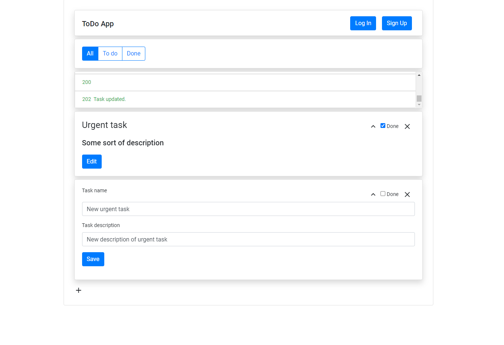

# ToDo_fullStackApp
Todo app using Angular and Spring Boot.
Deployed on amazon ec2: http://ec2-3-73-59-212.eu-central-1.compute.amazonaws.com:8081

## General info
This is the simplest application that I was able to use to learn proper full-stack development. When I started this app I knew nothing about front-end development so started from vanilla js. I quickly learned that programming client with vanilla js is quite pointless and moved to jquery. Jquery code quickly became quite chaotic. I was aware then that better frameworks structure code better so I moved to Angular with typescript as the ultimate solution. This was an interesting course in the history of evolution in front-end development for me.

## Screenshots

## Status:
-this app is work in progress

## Built with
* Angular 
* Spring Boot
* Gradle

## Contact
chajdas.lukasz@gmail.com
